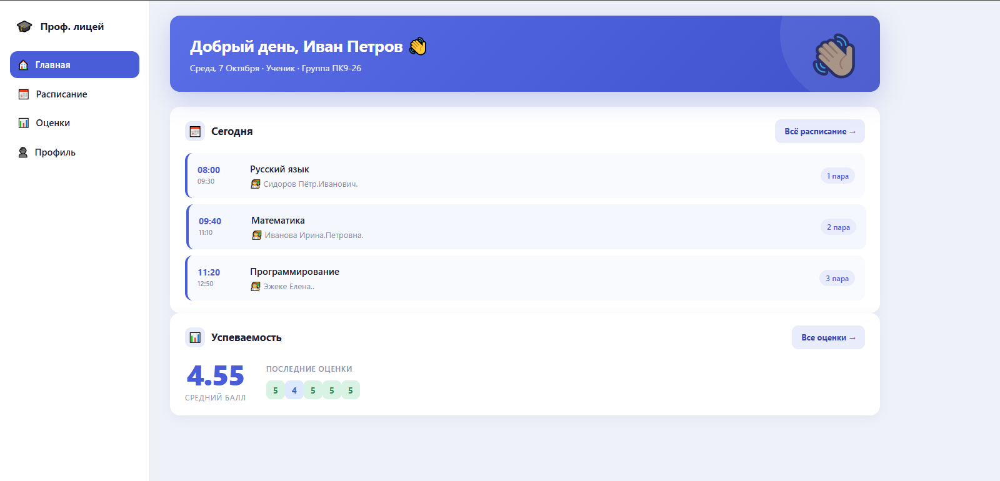
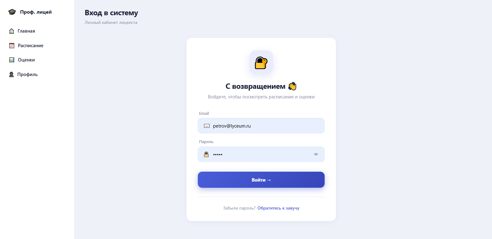
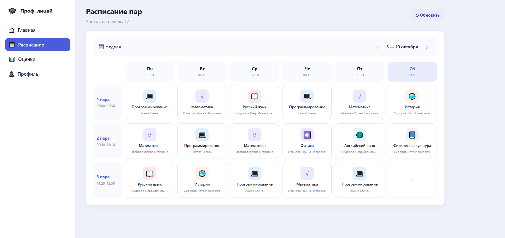
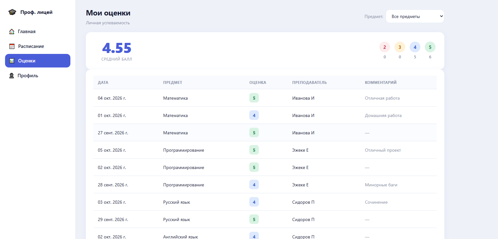
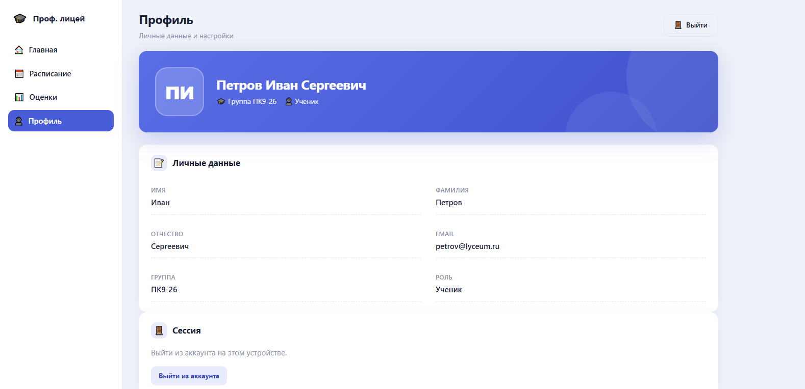
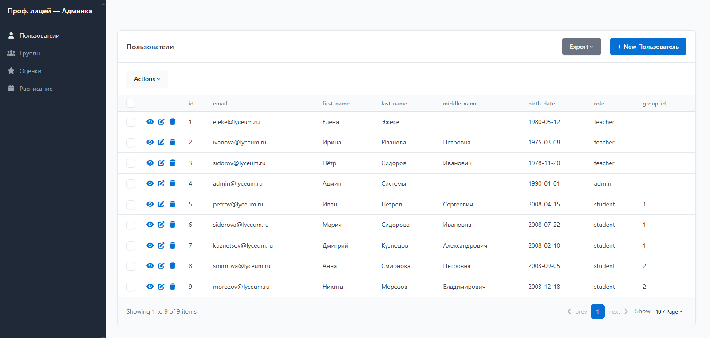

# Lyceum Hub


Веб-приложение для управления учебным процессом профессионального лицея: расписание, оценки, посещаемость и профили пользователей.



---

## 📖 О проекте

**Lyceum Hub** — это веб-приложение для профессионального лицея, которое автоматизирует основные задачи учебного процесса. Проект решает три задачи:

- **Для учеников** — просмотр расписания пар, оценок и посещаемости
- **Для учителей** — выставление оценок и работа с группами учеников
- **Для администрации** — управление пользователями, расписанием и оценками через встроенную админку

Проект разработан как pet-project для портфолио. **Backend** написан на FastAPI с SQLAlchemy 2.0. **Frontend** — на чистом JavaScript без фреймворков.

---

## ✨ Возможности

- 🔐 **Авторизация** через JWT в httponly-cookie
- 👥 **Три роли**: ученик, учитель, администратор
- 📅 **Расписание** на неделю (3 пары × 6 дней, включая субботу)
- 📊 **Оценки** с автоматическим расчётом среднего балла
- 📌 **Посещаемость**: Н (не был) / Б (болел) / У (уважительная) / О (опоздал)
- ✏️ **Выставление оценок** учителем через форму
- 👤 **Профиль** с редактированием данных
- 🛠 **Админка** (SQLAdmin) для управления всеми таблицами
- 🎨 **Адаптивный дизайн** на чистом CSS
- 🔒 **Basic Auth** для защиты админки

---

## 🛠 Стек технологий

**Backend:**
- Python 3.14
- FastAPI
- SQLAlchemy 2.0
- SQLite
- AuthX (JWT)
- Pydantic
- SQLAdmin
- bcrypt (хеширование паролей)

**Frontend:**
- Vanilla JavaScript (ES-модули)
- HTML5
- CSS3 (переменные, flexbox, grid)

**Инструменты:**
- Uvicorn
- python-dotenv

---

## 🚀 Установка

### Требования

- Python 3.14+
- pip
- Git

### 1. Клонировать репозиторий

```bash
git clone https://github.com/volgibf-cpu/lyceum-hub.git
cd lyceum-hub
```

### 2. Создать виртуальное окружение

```bash
python -m venv venv
```

Активировать:

```bash
# Linux / macOS
source venv/bin/activate

# Windows (cmd)
venv\Scripts\activate

# Windows (PowerShell)
venv\Scripts\Activate.ps1
```

### 3. Установить зависимости

```bash
pip install -r requirements.txt
```

### 4. Создать .env

Скопируй шаблон:

```bash
cp .env.example .env
```

Открой .env и заполни:

```
SECRET_KEY=сгенерируй-случайную-строку-64-символа
ADMIN_USER=admin
ADMIN_PASS=придумай-свой-пароль
DATABASE_URL=sqlite:///./lyceum.db
```

Сгенерировать SECRET_KEY:

```bash
python -c "import secrets; print(secrets.token_hex(32))"
```

### 5. Заполнить БД тестовыми данными

```bash
python seed.py
```

### 6. Запустить приложение

```bash
uvicorn src.main:app --reload --host 0.0.0.0 --port 8000
```

Открой в браузере: http://127.0.0.1:8000/app/login.html

---

## 👤 Демо-аккаунты

| Роль | Email | Пароль |
|------|-------|--------|
| 🎓 Ученик | `petrov@lyceum.ru` | `12345` |
| 👩‍🏫 Учитель | `ejeke@lyceum.ru` | `12345` |
| 👑 Админ | `admin@lyceum.ru` | `admin123` |

---

## 🛠 Админка

Админка доступна по адресу: **http://127.0.0.1:8000/admin**

Защищена Basic Auth. Логин и пароль — из .env (ADMIN_USER, ADMIN_PASS).

Что можно делать:

- 👥 Управлять пользователями (создание, редактирование, удаление)
- 🎓 Управлять группами
- 📊 Просматривать и редактировать оценки
- 📅 Редактировать расписание

---

## 📡 API

Swagger-документация: http://127.0.0.1:8000/docs

### Авторизация

| Метод | URL | Описание |
|-------|-----|----------|
| POST | `/auth` | Логин |
| POST | `/auth/logout` | Выход |

### Пользователи

| Метод | URL | Описание |
|-------|-----|----------|
| GET | `/users/me` | Профиль текущего пользователя |
| PATCH | `/users/me` | Обновить профиль |
| DELETE | `/users/me` | Удалить аккаунт |
| GET | `/users/student` | Список учеников группы (только учитель) |

### Расписание

| Метод | URL | Описание |
|-------|-----|----------|
| GET | `/pair/` | Расписание текущего пользователя |

### Оценки

| Метод | URL | Описание |
|-------|-----|----------|
| GET | `/grade/me` | Свои оценки (ученик) |
| GET | `/grade/student` | Оценки конкретного ученика (учитель) |
| GET | `/grade/group` | Оценки группы (учитель) |
| POST | `/grade/set` | Выставить оценку (учитель) |

---

## 📁 Структура проекта

```
lyceum-hub/
├── src/
│   ├── api/
│   ├── core/
│   ├── models/
│   ├── schemas/
│   ├── admin.py
│   └── main.py
├── frontend/
│   ├── app/
│   └── static/
│       ├── css/
│       └── js/
├── docs/
│   └── screenshots/
├── seed.py
├── requirements.txt
├── .env.example
├── .gitignore
├── LICENSE
└── README.md
```

---

## 🖼 Скриншоты

### Логин


### Главная


### Расписание


### Оценки


### Профиль


### Админка


---

## 🔒 Безопасность

- ✅ Пароли хешируются через bcrypt
- ✅ JWT хранится в httponly-cookie
- ✅ CSRF-защита AuthX
- ✅ Валидация данных через Pydantic
- ✅ Проверка ролей на каждом эндпоинте
- ✅ Basic Auth для админки
- ✅ Секреты хранятся в .env (не в коде)

---

## 🗺 Roadmap

- [x] Авторизация и роли
- [x] Расписание
- [x] Оценки и посещаемость
- [x] Профиль
- [x] Админка через SQLAdmin
- [x] Basic Auth для админки
- [x] Хеширование паролей
- [ ] Мобильная PWA-версия
- [ ] Экспорт оценок в Excel
- [ ] Push-уведомления о новых оценках
- [ ] Деплой на Render

---

## 🤝 Как внести вклад

1. Форкни репозиторий
2. Создай ветку: `git checkout -b feature/amazing-feature`
3. Закоммить: `git commit -m "Add amazing feature"`
4. Запушь: `git push origin feature/amazing-feature`
5. Открой Pull Request

---

## 📄 Лицензия

Этот проект распространяется под лицензией **MIT**. 
Подробности — в файле [LICENSE](LICENSE).

---

## 📬 Контакты

- **Автор:** volgibf-cpu
- **GitHub:** [@volgibf-cpu](https://github.com/volgibf-cpu)